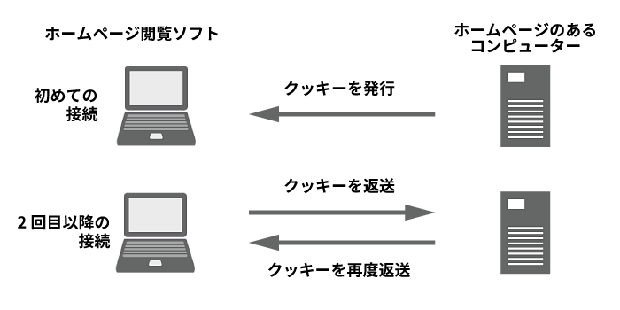
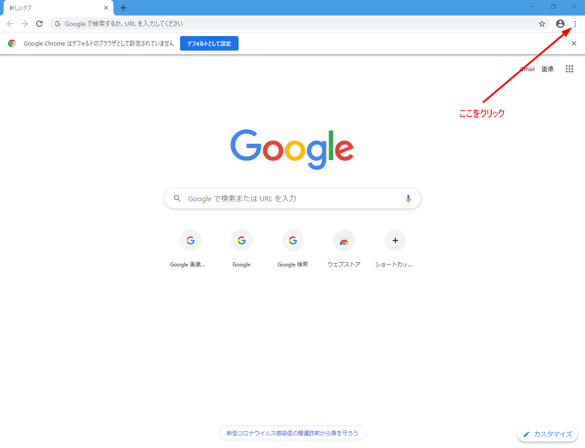
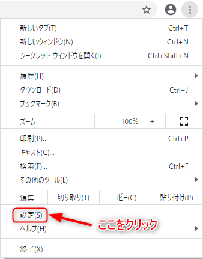
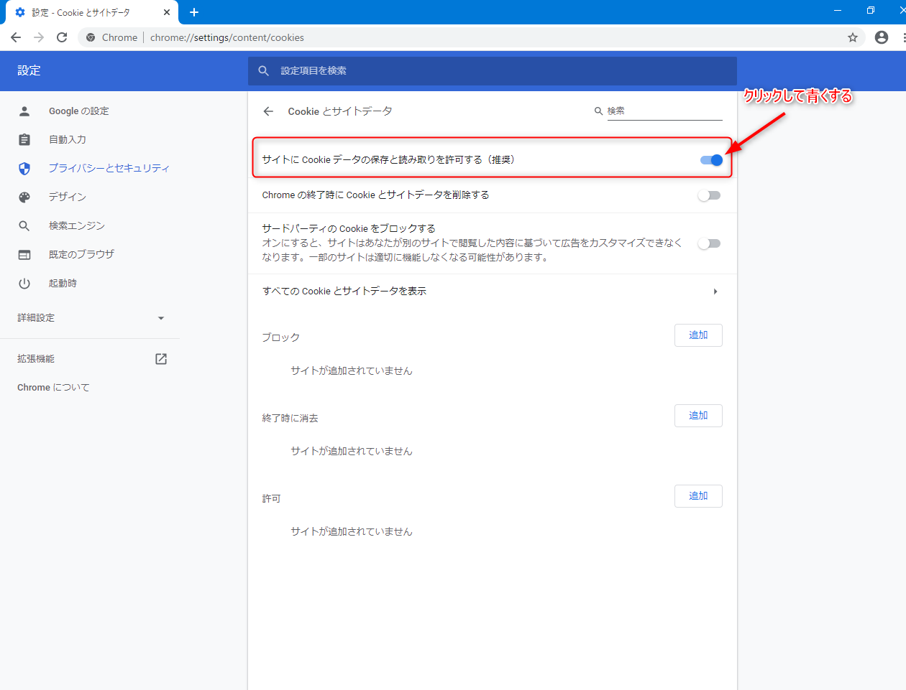

ホームページの閲覧に欠かせない「クッキー」の役割とプライバシー保護の観点からGoogle Chromeを例に適切な設定法をご紹介いたします。ｓ

目次
- [クッキーとは何か](#クッキーとは何か)？
- [プライバシー問題](#プライバシー問題)
- [クッキーの規制](#クッキーの規制)
- [われわれにできる対処法は？](#われわれにできる対処法は？)
- [サードパーティ・クッキーをブロックする方法](#サードパーティ・クッキーをブロックする方法)
- [あとがき](#あとがき)

## クッキーとは何か？

ホームページ閲覧ソフトでホームページを見ると、このようなメッセージが突然現れたことはありませんか？

クッキーとは、あなたの使用しているホームページ閲覧ソフトとホームページを設置しているコンピューターとやり取りするためのファイルです。

簡単に言うと病院の診察券のようなものです。

初めに診察券を発行してもらい、それ以降はあなたの診察券をもとに情報のやり取りが行われます。

毎回、診察券の情報を病院側に伝えていたら大変な手間ですよね。

病院側にあなたの個人情報をあずけるけるわけですから、お互いの信頼関係のもとに行われている仕組みです。

クッキーを利用する上で馴染みが深いのは、本来なら何度も必要になるIDとパスワードの入力を省略したり、通信販売のホームページでの買い物かごに入れた商品を後から再度入れ直さなくてよかったりすることです。

## プライバシー問題

ホームページを閲覧する上でとても便利なクッキーですが、問題もあります。

それはプライバシーです。

あるホームページで自分の地域の記事を見ると、全く別のホームページで自分の地域に関連した広告が表示されて驚いたことはないでしょうか？

こうした問題が多くのページで起きています。

これは、ホームページ管理者だけでなく、ホームページに貼られた広告の管理者など第三者がクッキーの情報を利用していることを示唆しています。

このため、複数のホームページを横断する形であなたの情報を得ることができるのです。

## クッキーの規制

こうしたプライバシーの問題によって、世界的にクッキーの規制強化が進んでいます。

EUの一般データ保護規則(GDPR)では、「クッキーを使用する上でホームページ閲覧者の同意が必要である」としました。

こうした流れに追従する形で、日本のホームページでもクッキーの同意を求める動きが出てきています。

## われわれにできる対処法は？

こうした懸念に具体的にどのように私たちは対処すればいいのでしょうか？

何か監視されているようで嫌だなと思う場合はどうしたらいいのでしょうか？

まず、ご説明しましたとおり、クッキーという仕組みはとても便利なものです。

利用しなければ正常な閲覧ができないホームページも存在します。

ですから、利用せざるをえない部分があるので、ファーストパーティ・クッキーだけを使用するようにしてはどうかと思います。

### ファーストパーティ・クッキー

ファーストパーティ・クッキーとは、ホームページ閲覧者とホームページのあるコンピューターとの間で発行されるクッキーのことです。

### サードパーティ・クッキー

サードパーティ・クッキーというのは、そのホームページのあるコンピューターとは別（第三者）のコンピューターとの間で発行されるクッキーのことです。

## サードパーティ・クッキーをブロックする方法

ここでは、サードパーティ・クッキーをブロックする手順を、利用者の多いホームページ閲覧ソフトであるグーグルクロームPC版を例にご説明いたします。

この設定により、ファーストパーティ・クッキーはブロックされることはありませんので、ホームページの閲覧に支障をきたすことはありません。

### 1.右上の3点マークをクリックする

グーグルクロームを起動して、画面右上の3点マークをクリックしてください。

### 2. 「設定」をクリックする

出てきたメニューから「設定」をクリックしてください。

### 3. 「サイトの設定」をクリックする

「プライバシーとセキュリティ」の項目から「サイト設定」をクリックしてください。

### 4. 「Cookieとサイトデータ」をクリックする

### 5. 「サイトにCookieデータの保存と読み取りを許可する（推奨）」をオフにする

「サイトにCookieデータの保存と読み取りを許可する（推奨）」の右端にある丸いスイッチのマークをクリックして青くしてください。

### 6. 「サードパーティのCookieをブロックする」をオフにする

「サードパーティのCookieをブロックする」の右端にある丸いスイッチのマークをクリックして青くする。

## あとがき

いかがでしたでしょうか？

クッキーは、ホームページを閲覧する上でなくてはならない仕組みです。

クッキーを利用できなければ、利便性はかなり下がるといっていいでしょう。

しかし、こうした仕組みを理解しておくことで、クッキーを食べながら驚いてむせっかえることもなくなるのではないでしょうか！

インターネットを利用したサービスを受ける上で個人情報の問題は切っても切り離せません。

クッキーに限らず、ウィルス対策ソフトを導入やあやしいホームページを閲覧しないように心がけるなど個人情報への最低限の取り組みはしておきたいものですね。

以上です。読んでいただきありがとうございました。
