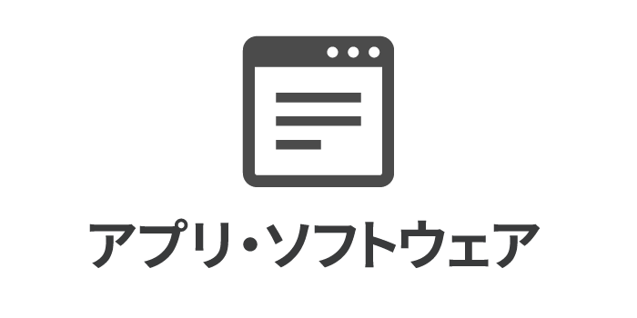

「フリーソフト」とは何なのか、ということをご紹介いたします。

目次
- [フリーソフトとは？](#フリーソフトとは？)
- [開発や配布の中止も](#開発や配布の中止も)
- [フリーソフトでの失敗](#フリーソフトでの失敗)
- [あとがき](#あとがき)

## フリーソフトとは？

フリーソフトとは、無償で提供されてるソフトウェアです。主に作成者のご厚意により配布され、ユーザーは使うことができます。とてもありがたいものですね。

ちなみに、「フリーソフト」は、「フリーソフトウェア」の略称ではありません。「フリーソフトウェア」とは、「自由なソフトウェア」という意味です。フリーソフトウェアは、その設計図が公開され、それらを改変したり、利用したりすることが認められたものです。ここでは、フリーソフトウェアについて、これ以上触れないこととします。

フリーソフトは、ワードなど高機能なソフトウェアに比べると機能が少なめです。これは個人が開発しているからというのもあるでしょう。しかし、作者の方が必要に迫られて開発されたものであったりするので、多くの人に受け入れられる可能性があります。

### フリーソフトのメリット

フリーソフトのメリットは、無料で提供されていることです。公開すると多くの人たちが利用しますので、そのソフトの不具合も発見されやすく、修正もしてもらいやすくなります。ユーザーの要望も受け入れてもらいやすいかもしれません。

### フリーソフトのデメリット

フリーソフトのデメリットは、その利用はユーザーの自己責任ということです。つまり、ユーザーが利用することによる損害は一切保証されません。こうした損害のリスクは、企業が作成するソフトウェアより高いのかもしれません。ソフトウェアの設計図が公開されない場合がほとんどなので、どのような仕組みで動いているのかもわかりません。これは場合によっては大きな問題になります。この点は注意しておいたほうがいいでしょう。

また、フリーソフトはプログラムです。インターネット上には悪意のあるプログラムもあります。よくわからないウェブサイトから無闇にダウンロードして試すべきではありません。後述する「窓の杜」のようなフリーソフト紹介サイトを通じて入手するのが安全でしょう。それでも最低限、ウィルス対策ソフトを導入しておくなどの予防策は必要だと考えます。

## 開発や配布の中止も

便利なフリーソフトですが、個人が開発してるがゆえにその作成者の方の事情から、突然開発を中止されたり、配布を停止したりすることがあります。

企業の開発したソフトウェアでもそういう例はもちろんありますが、フリーソフトはそこまでユーザーに責任を負うことはありません。

## フリーソフトは保存しておく

フリーソフトは配布停止されても新たに入手する手段がありません。作者の方次第になります。通常では再配布も認められてないことが多いので、他の方からいただくこともできません。また、出所不明のフリーソフトを安易にインストールするべきでもありません。

このような事情から、頻繁に使用するフリーソフトはいつでも入手できるとは考えずに、手元に保存しておくことをおすすめしたします。

## あとがき

フリーソフトはそれだけで完結するソフトウェアというよりも、かゆいところに手の届く補助的なソフトウェアが多いです。うまく利用することでPCやスマホでの仕事の効率化は劇的に変わります。

幸い、フリーソフトを紹介しているウェブサイトがあります。その一つである窓の杜([https://forest.watch.impress.co.jp/](https://forest.watch.impress.co.jp/))を紹介させていただきます。昔からあるサイトです。長年の情報の蓄積や信頼がありますので、ここに掲載されているフリーソフトは使いやすいかと思います。

どのような機能を持つソフトウェアがあるのか知ることができて楽しいですよ。

フリーソフトを取得するには、「ダウンロード」や「インストール」など、新しい理解が必要になります。まずはそれらについてご理解の上、試してみてください。

以上です。読んでいただきありがとうございました。
